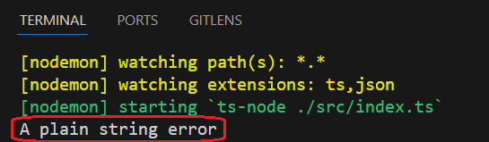
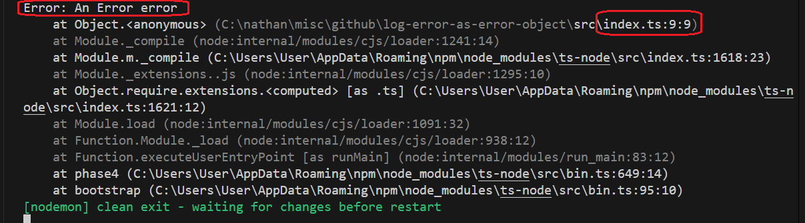
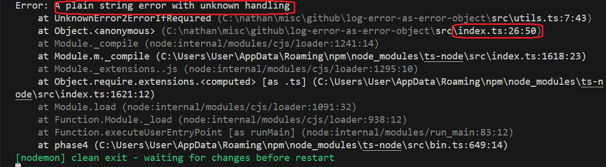
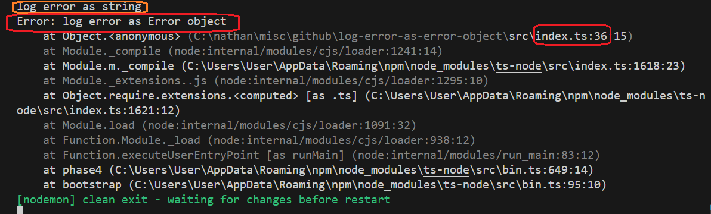

<h1>Project Name</h1>
Log and Catch Errors with the Error Object

<h2>Project Description</h2>
<p>
  This project demonstrates the importance of proper error handling in JavaScript and TypeScript.
  It provides clear examples that show why using the built-in <code>Error</code> object is superior
  to throwing or logging plain strings. When you use <code>Error</code> objects, stack traces are preserved,
  which is essential for effective debugging and understanding the root cause of errors.
</p>

<h2>Motivation</h2>
<p>You have an error and you want to log it: should you use a string or an <code>Error</code> object? The answer is always to use an <code>Error</code> object, and this is especially important for two key use cases:</p>
<ul>
  <li>inside a catch block</li>
  <li>outside a catch block</li>
</ul>

<h2>Installation</h2>

```bash
pnpm i
```

<h2>Usage</h2>

```bash
pnpm run dev
```

<h2>Technologies Used</h2>
<ul>
<li>TypeScript</li>
<li>Node.js</li>
</ul>

<h2>Code</h2>
This function is used later in the demo

```ts
/**
 * Ensures that a value is an instance of Error.
 * If the value is not an Error, it is wrapped in a new Error object.
 * This is useful for `catch` blocks that might receive non-Error values.
 */
export const UnknownError2ErrorIfRequired = (error: unknown): Error => {
  return error instanceof Error ? error : new Error(String(error));
};
```

<h2>Demo</h2>

<p>The following examples illustrate the difference between throwing and logging strings versus <code>Error</code> objects.</p>

<h3>1. Throwing a string</h3>

```ts
try {
  throw "A plain string error";
} catch (e) {
  // -- e is unknown
  console.log(e);
}
```

<p> The result: only the string "A plain string error" is printed. No stack trace is available. </p> 


<h3>2. Throwing an Error object</h3>

```ts
try {
  throw new Error("An Error error");
} catch (e) {
  // -- e is known
  console.log(e);
}
```

<p>
  The result is as follows: the message <code>"An Error error"</code> appears along with a full stack trace, 
  showing the exact file (<code>index.ts</code>) and line number (<code>9</code>) where the error was thrown. 
  Logging with stack traces makes debugging much simpler.
</p>



<h3>3. Catching unknown and converting to Error</h3>

```ts
try {
  throw "A plain string error with unknown handling";
} catch (e) {
  // -- e is unknown
  const finalError = UnknownError2ErrorIfRequired(e);
  console.log(finalError);
}
```

<p>
  The result is as follows: the string <code>"A plain string error with unknown handling"</code> appears, 
  along with a stack trace showing the file (<code>index.ts</code>) and line number (<code>26</code>).
  However, since the original error was a string, the stack trace points to where the <code>Error</code> object 
  was created—not where the string was thrown.
</p>



<h3>4. Logging string vs. Error</h3>

```ts
console.error('log error as string')
console.error(new Error('log error as Error object'))

```

<p><strong>Logging a string</strong> (orange): only the message "log error as string" is shown.</p> <p><strong>Logging an Error object</strong> (red): includes both the message and a full stack trace, showing the exact file and line where the error was created.</p>

 

<h2>Key Takeaways</h2> 
<ul> 
<li>Always use <code>Error</code> objects when throwing or logging errors</li> 
<li>In <code>catch</code> blocks, convert unknown values to <code>Error</code> objects for consistent logging</li> 
</ul>


<h2>References</h2>
<ul>
    <li><a href='https://youtu.be/TsDjJ5LuJtc?si=UNB-VVikfH_AHVgU'> using ts-node in a node typescript project setup </a></li>
</ul>
